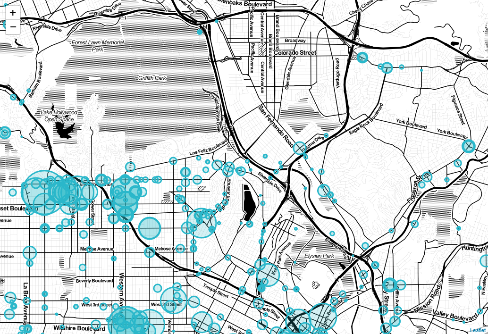
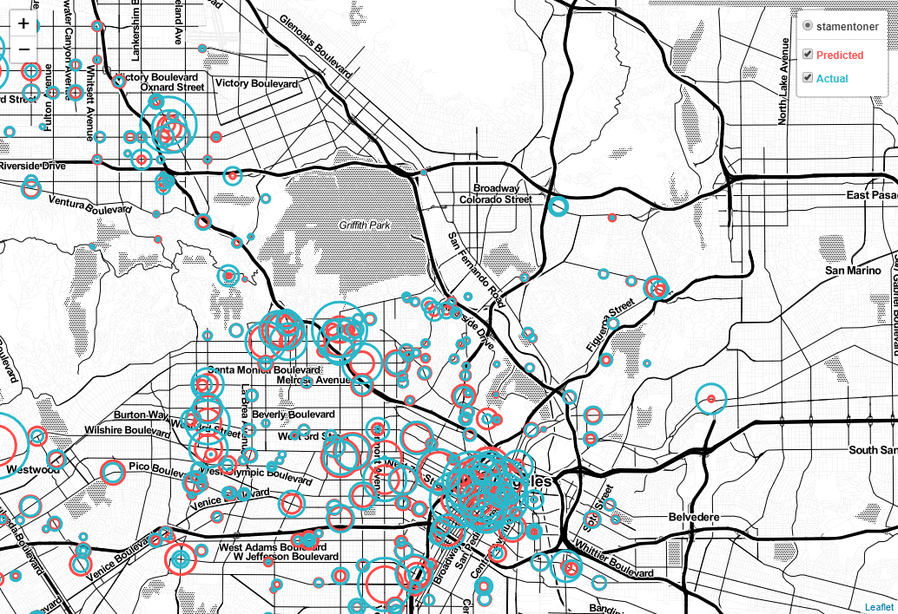

## Modeling Pedestrian Volume at Intersections in Los Angeles

#### Background
The Los Angeles Department of Transportation (LADOT) collects volume data related to bicyclists, pedestrians, and motor vehicles for the purposes of transportation planning. Historically, these data have been stored in a PDF format, which makes it easy to digest a single traffic count, but prevents comparison and analysis of multiple counts. The goal of this project was to (1) convert these data into usable tables so the department can better understand travel trends and (2) construct a model to predict pedestrian activity at an intersection given built environment features. I completed this project as the final capstone requirement for Udacity's Machine Learning Nanodegree.

#### Data Assembly
* Target Variable: LADOT historically collects manual counts at intersections, which include vehicle, bicycle, bus, and pedestrian volumes. I was able to extract 1,600 pedestrian volume counts from these sheets.
* Features: pop. (ACS), emp. (ACS), transit ridership (LA Metro), presence of a signal (LADOT), school count within ¼ mi (LAUSD) 

#### Model Construction
* Two models: (1) OLS linear regression and (2) decision-tree
* Train / Test Split: 70% train, 30% test

#### Results
* Best Model: Decision Tree (2) with R^2 of .56
* Important Features: Population & Employment
* Error Distribution (see box plot)
  + 25% of test samples with error < 25%
  + 50% of test samples with error < 49%

## File Organization
* Initial Project Proposal with Literature Review: *project_proposal/MLN Project Proposal.pdf*
* Notebook: *PredictingPedestrianVolumes.ipynb*
* Data: *data/FeatureData*
* Final PDF Report: *pdf/PredictingPedestrianVolumes.pdf*
* HTML Map of Test Results: *html/predmap.html*

## Related Work
* Project to extract data from PDFs
* R Shiny Viewer
